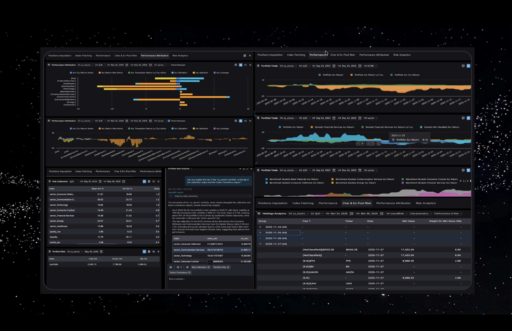

# OpenPort — Portfolio Analytics Library


**OpenPort** (`oport`) is a standalone Python library for portfolio analytics, risk modelling, and performance attribution. It is the analytics engine behind [open-Portfolio](https://www.open-portfolio.com). The library ships with an [OpenBB](https://openbb.co/) router so its commands are also accessible directly from the OpenBB terminal.<br> 
***Note:*** This library has been develped using OpenBB as Front-End, but there is not dependecny form OpenBB technology. The library can be used as a standalone component.

<p align="center">
  
</p>

> 📄 **Documentation**
> - [oport API Paper](https://open-portfolio.com/assets/open_portfolio_api_paper_v1.pdf) — full description of the API design, data model, and analytics methodology.
> - [oport Risk Model](https://open-portfolio.com/assets/Open-Portfolio-RiskModel.pdf) — detailed specification of the multi-factor risk model (factor construction, EWMA covariance, VaR).

---

## Features

| # | Command | Description | Input | Output |
|---|---------|-------------|-------|--------|
| 1 | `impute_positions` | Reconstructs full daily historical positions from a sparse transaction log. Fetches live prices, resolves currencies, and forward-fills holdings between trades. | Transaction file (CSV/XLS) + JSON field mapping | Daily imputed positions CSV; one row per ticker per day |
| 2 | `holdings` | Reads imputed positions and computes per-holding analytics over a date range. Supports optional fundamental characteristics (P/E, EPS, …), ex-post risk metrics, and free-form bucketing by any classification field (e.g. currency, sector, security type). | Portfolio + benchmark holdings files; date range; classification fields | Holdings DataFrame with analytics, bucketed aggregates, and benchmark comparison |
| 3 | `performance_attribution` | Runs Brinson–Hood–Beebower attribution over a date range, decomposing active return into allocation, selection, and interaction effects at each classification level. | Portfolio + benchmark holdings; date range; classification scheme | Attribution DataFrame per bucket and date, with allocation / selection / interaction columns |
| 4 | `portfolio_totals` | Aggregates daily performance across the full time frame into top-level and bucket-level summary statistics (total return, annualized return, Sharpe, max drawdown, …) for both portfolio and benchmark. | Portfolio + benchmark holdings; optional date range | Nested dictionaries of aggregated metrics (portfolio, buckets, benchmark) |
| 5 | `risk_calibration` | Calibrates a BARRA-style multi-factor risk model (style + industry factors, EWMA covariance, WLS regressions) on the tickers present in a portfolio's holdings. Serialises the fitted calibrator to `risk_model.pkl` for reuse across all portfolio-level risk calls. See the [Risk Model paper](https://open-portfolio.com/assets/Open-Portfolio-RiskModel.pdf). | Portfolio holdings (used to derive the stock universe); training date range | Calibration summary DataFrame (R², factor t-stats, residual diagnostics); `risk_model.pkl` written to storage |
| 6 | `get_factor_covariance` | Loads the latest `risk_model.pkl` and returns the annualized factor–factor covariance matrix (style + industry factors). Useful for scenario analysis and factor exposure reporting. See the [Risk Model paper](https://open-portfolio.com/assets/Open-Portfolio-RiskModel.pdf). | `risk_model.pkl` in storage | Square DataFrame (factors × factors) with annualized covariances |
| 7 | `get_portfolio_risk` | Computes a full ex-ante risk snapshot for a portfolio as of a given date. Decomposes total volatility into factor-driven and idiosyncratic components, and calculates parametric VaR at the requested confidence level and horizon. See the [Risk Model paper](https://open-portfolio.com/assets/Open-Portfolio-RiskModel.pdf). | Portfolio holdings; `risk_model.pkl`; optional date, confidence level, horizon, and market value | Single-row DataFrame: `total_vol`, `factor_vol`, `idio_vol`, `total_var`, `sigma_daily`, `sigma_horizon`, `VaR_pct` (and optionally `VaR_value`) |
| 8 | `regime_calibration` | Calibrates a Wasserstein-HMM regime model on the factor-return history of an already-calibrated risk model. Uses a strictly causal rolling HMM with predictive model-order selection and Wasserstein identity tracking so regime labels stay stable across refits. Serialises the fitted calibrator to `regime_model.pkl`. Requires `risk_calibration` first. | `risk_model.pkl`; optional date range; regime-order / window knobs (`min_regimes`, `max_regimes`, `estimation_window`, `refit_frequency`, `order_selection_holdout`) | Per-regime summary DataFrame (`persistence_p_ii`, `expected_dwell_days`, `pct_of_sample`, …); `regime_model.pkl` written to storage |
| 9 | `get_regime_summary` | Loads the latest `regime_model.pkl` and returns a snapshot of the currently active regime joined with the full per-regime summary (persistence, expected dwell time, sample share). | `regime_model.pkl` in storage | DataFrame with current-regime fields (`confidence`, `expected_dwell_days`, `as_of`) plus summary columns for every tracked regime |
| 10 | `construct_portfolio` | Builds a regime-aware, transaction-cost-aware target portfolio over a universe (index constituents or existing portfolio holdings). Maps the current regime's conditional factor moments onto each name via its Barra-style factor exposures, then solves a long-only mean-variance problem with optional name-count and weight caps. Requires both `risk_model.pkl` and `regime_model.pkl`. | Universe name (holdings prefix); risk + regime models; optional date, `target_n`, `max_weight`, `transaction_cost_bps`, `risk_aversion` | DataFrame indexed by ticker: `weight`, `prev_weight`, `trade`, `expected_return_regime`, `regime_id`, `regime_confidence`, `expected_hold_days` |
| 11 | `get_portfolio_tree_risk` | Euler risk-contribution decomposition as of a given date. For each holding it computes standalone volatility (total, factor, idiosyncratic) and its Euler contribution to portfolio risk (`RC_vol`, `RC_pct`). Security rows sum exactly to the portfolio total (Euler's theorem). The portfolio summary row is identical to `get_portfolio_risk` output. Requires `risk_model.pkl`. | Portfolio holdings; `risk_model.pkl`; optional date, confidence level, horizon, and market value | DataFrame with one row per holding + `portfolio` summary row: `weight`, `total_vol`, `factor_vol`, `idio_vol`, `factor_share`, `RC_vol`, `RC_pct`; portfolio row also carries `total_var`, `sigma_daily`, `sigma_horizon`, `VaR_pct` |

---

## Installation

The project is managed with [Poetry](https://python-poetry.org/). The `pyproject.toml` at the root of the repository declares all dependencies and the OpenBB plugin entry points.

### Prerequisites

- Python `>=3.10, <3.13`
- [Poetry](https://python-poetry.org/docs/#installation) installed globally

### Steps

1. **Clone the repository**:
   ```bash
   git clone <repo-url>
   cd oport
   ```

2. **Create a virtual environment** and tell Poetry to use it:
   ```bash
   python -m venv .venv
   poetry config virtualenvs.in-project true   # keeps .venv inside the project dir
   ```

3. **Install dependencies** (Poetry resolves and locks everything from `pyproject.toml`):
   ```bash
   poetry install
   ```
   This installs all runtime dependencies: `yfinance`, `pandas`, `numba`, `boto3`, `paramiko`, `pydantic`, `fastapi`, `plotly`, and more. `openbb-core` is also pulled in, but is only required to expose the commands through the OpenBB router/terminal — the Python API (`oport_api.py`) works independently of it.

4. **Activate the virtual environment**:
   ```bash
   poetry shell
   # or, without Poetry shell:
   source .venv/bin/activate   # macOS / Linux
   .venv\Scripts\activate      # Windows
   ```

4. **Verify the OpenBB extension is registered**:
   ```python
   from openbb import obb
   print(obb.oport)
   ```

> **Note**: The OpenBB router and provider are registered automatically via the `pyproject.toml` plugin entry points:
> ```toml
> [tool.poetry.plugins."openbb_core_extension"]
> oport = "oport.router:router"
>
> [tool.poetry.plugins."openbb_provider_extension"]
> oport = "oport.provider:provider"
> ```

---


## Data Sources

All commands accept a `source` parameter:

| Value | Required parameters |
|-------|---------------------|
| `"filesystem"` | `filesystem_folder` |
| `"s3"` | `bucket_name`, `access_key_id`, `secret_access_key`, `s3_host`, `s3_port` |
| `"ftp"` | `ftp_host`, `ftp_user`, `ftp_pass` |

### Input files

| File | Description |
|------|-------------|
| Transaction file | CSV or Excel (e.g. `transactions.xls`) with one row per trade. |
| Field mapping | JSON file (e.g. `transactions_field.json`) mapping your column names to oport's internal fields. |

Example `transactions_field.json`:

```json
{
  "column_mapping": {
    "tr_sign":           "buy_sell",
    "position amount":   "quantity",
    "transaction cost":  "price",
    "ccy":               "currency",
    "ISIN":              "isin",
    "transaction date":  "transaction_date"
  },
  "columns_name_row": 4,
  "data_row_offset":  5
}
```

---

## Python API Examples

### 1. Impute Positions

```python
from openbb import obb

result = obb.oport.impute_positions(
    source="filesystem",
    transaction_file="transactions.xls",
    transactions_field_mapping="transactions_field.json",
    filesystem_folder="/path/to/folder",
    output_file_name="my_portfolio",
    portfolio_base_ccy="EUR"
)
print(result.to_df())
```

### 2. Holdings Analytics

```python
result = obb.oport.holdings(
    portfolio_name="my_portfolio",
    benchmark_name="oex_idx",
    classification="ccy|securityType",
    start_date="10-01-2024",
    end_date="10-28-2024",
    characteristics="Diluted_EPS|Basic_Average_Shares|P-E",
    source="filesystem",
    filesystem_folder="/path/to/folder"
)
print(result.to_df())
```

### 3. Performance Attribution

```python
result = obb.oport.performance_attribution(
    portfolio_name="my_portfolio",
    benchmark_name="oex_idx",
    start_date="10-01-2024",
    end_date="10-28-2024",
    source="filesystem",
    filesystem_folder="/path/to/folder"
)
print(result.to_df())
```

### 4. Portfolio Totals

```python
result = obb.oport.portfolio_totals(
    portfolio_name="my_portfolio",
    benchmark_name="oex_idx",
    start_date="10-01-2024",
    end_date="10-28-2024",
    source="filesystem",
    filesystem_folder="/path/to/folder"
)
print(result.to_df())
```

### 5. Risk Calibration

Calibrate the factor risk model for a stock universe derived from a portfolio's holdings. The calibrated model is serialised to `risk_model.pkl` in `filesystem_folder`.

```python
result = obb.oport.risk_calibration(
    calibration_universe="my_portfolio",
    start_date="2024-01-01",
    end_date="2024-10-31",
    source="filesystem",
    filesystem_folder="/path/to/folder"
)
print(result.to_df())   # calibration summary
```

### 6. Factor Covariance Matrix

```python
result = obb.oport.get_factor_covariance(
    source="filesystem",
    filesystem_folder="/path/to/folder"
)
print(result.to_df())
```

### 7. Portfolio Risk & Ex-Ante VaR

Returns a single-row DataFrame that combines risk decomposition and ex-ante parametric VaR:

| Column | Description |
|--------|-------------|
| `total_vol` | Annualized total volatility (decimal, e.g. `0.15` = 15 %) |
| `factor_vol` | Annualized factor-driven volatility |
| `idio_vol` | Annualized idiosyncratic volatility |
| `total_var` | Annualized total variance |
| `confidence` | VaR confidence level (0.95 or 0.99) |
| `horizon_days` | VaR horizon in trading days |
| `sigma_daily` | Daily 1-sigma (decimal) |
| `sigma_horizon` | Horizon-scaled sigma (sqrt-of-time) |
| `VaR_pct` | Parametric VaR as a fraction of portfolio value |
| `VaR_value` | VaR in currency units *(only when `portfolio_mv` is supplied)* |

```python
# Basic call — defaults: 95 % confidence, 1-day horizon
result = obb.oport.get_portfolio_risk(
    portfolio_name="my_portfolio",
    source="filesystem",
    filesystem_folder="/path/to/folder"
)
print(result.to_df())

# With explicit VaR parameters and absolute VaR in EUR
result = obb.oport.get_portfolio_risk(
    portfolio_name="my_portfolio",
    source="filesystem",
    filesystem_folder="/path/to/folder",
    input_date="2024-10-28",   # defaults to today if omitted
    confidence=0.99,
    horizon_days=10,
    portfolio_mv=1_000_000     # portfolio market value in base currency
)
print(result.to_df())
```

### 8. Regime Calibration

Calibrate a Wasserstein-HMM regime model on the factor-return history stored inside an already-calibrated `risk_model.pkl`. The fitted regime calibrator is serialised to `regime_model.pkl` in the same storage folder.

**Pipeline dependency:** run `risk_calibration` first.

```python
result = obb.oport.regime_calibration(
    source="filesystem",
    filesystem_folder="/path/to/folder",
    start_date="2024-01-01",   # optional window over factor returns
    end_date="2024-10-31",
    min_regimes=2,             # defaults shown
    max_regimes=4,
    estimation_window=252,     # trading-day lookback per fit
    refit_frequency=21,        # days between HMM refits
    order_selection_holdout=21 # holdout for predictive K selection
)
print(result.to_df())   # per-regime summary
```

| Column | Description |
|--------|-------------|
| `persistence_p_ii` | Self-transition probability of the regime |
| `expected_dwell_days` | Expected sojourn time in trading days (`1 / (1 − p_ii)`) |
| `pct_of_sample` | Share of the estimation history labelled as this regime |
| `is_current` | Whether this is the active regime as of the last observation |

### 9. Regime Summary

Loads `regime_model.pkl` and returns the current-regime snapshot joined with the full per-regime summary.

```python
result = obb.oport.get_regime_summary(
    source="filesystem",
    filesystem_folder="/path/to/folder"
)
print(result.to_df())
```

| Column | Description |
|--------|-------------|
| `confidence` | Filtered probability of the currently active regime |
| `expected_dwell_days` | Expected remaining/sojourn days for the current regime |
| `as_of` | Date of the last observation used for the snapshot |
| *(plus summary cols)* | Persistence / dwell / sample-share columns for every tracked regime |

### 10. Regime-Aware Portfolio Construction

Builds a long-only, transaction-cost-aware target portfolio conditioned on the current market regime. The universe is resolved the same way as other portfolio APIs (`<universe_name>_DAILY_HOLDINGS` files); if no holdings are found, it falls back to every ticker in the risk model's latest exposure matrix.

**Pipeline dependency:** run `risk_calibration` then `regime_calibration` first (both pickles must live in the same `filesystem_folder` as the universe holdings).

| Column | Description |
|--------|-------------|
| `weight` | Target portfolio weight |
| `prev_weight` | Previous weight from the universe holdings (0 if starting from cash) |
| `trade` | Suggested trade (`weight − prev_weight`) |
| `expected_return_regime` | Regime-conditional expected return for the name |
| `regime_id` | Active market-wide regime driving the construction |
| `regime_confidence` | Filtered probability of that regime |
| `expected_hold_days` | Suggested holding horizon (= regime expected dwell time) |

```python
# Basic call — long-only mean-variance under the current regime
result = obb.oport.construct_portfolio(
    universe_name="my_portfolio",   # or an index name used as the stock universe
    source="filesystem",
    filesystem_folder="/path/to/folder",
    input_date="2024-10-28",        # defaults to today if omitted
)
print(result.to_df())

# With name-count and single-name weight caps
result = obb.oport.construct_portfolio(
    universe_name="my_portfolio",
    source="filesystem",
    filesystem_folder="/path/to/folder",
    input_date="2024-10-28",
    target_n=20,                    # hold at most 20 names
    max_weight=0.10,                # 10 % single-name cap
    transaction_cost_bps=10.0,
    risk_aversion=5.0,
)
print(result.to_df())
```

### 11. Portfolio Tree Risk (Euler Risk-Contribution Decomposition)

Returns one row per holding with standalone risk metrics and its Euler contribution to portfolio risk, plus a `portfolio` summary row identical to `get_portfolio_risk` output.

The Euler decomposition (`RC_vol`, `RC_pct`) satisfies:
- `sum(security_rows["RC_vol"]) == portfolio total_vol`
- `sum(security_rows["RC_pct"]) == 100.0`

| Column | Security rows | Portfolio row |
|--------|--------------|---------------|
| `weight` | Portfolio weight (0–100 scale) | 100 |
| `total_vol` | Annualised standalone vol (%) | Portfolio total vol (%) |
| `factor_vol` | Factor component of standalone vol (%) | Portfolio factor vol (%) |
| `idio_vol` | Idio component of standalone vol (%) | Portfolio idio vol (%) |
| `factor_share` | Factor share of standalone variance | Portfolio factor share |
| `RC_vol` | Euler vol contribution (%), sums to `total_vol` | `= total_vol` |
| `RC_pct` | % share of portfolio variance, sums to 100 | 100.0 |
| `total_var` | — | Annualised portfolio variance |
| `confidence` | — | VaR confidence level |
| `horizon_days` | — | VaR horizon (trading days) |
| `sigma_daily` | — | Daily 1-sigma (%) |
| `sigma_horizon` | — | Horizon-scaled sigma (%) |
| `VaR_pct` | — | Parametric VaR (% of portfolio value) |
| `VaR_value` | — | VaR in currency units *(when `portfolio_mv` supplied)* |

```python
# Basic call — security-level risk budget as of a given date
result = obb.oport.get_portfolio_tree_risk(
    portfolio_name="my_portfolio",
    source="filesystem",
    filesystem_folder="/path/to/folder",
    input_date="2024-10-28",   # defaults to today if omitted
)
df = result.to_df()
print(df[["weight", "total_vol", "RC_vol", "RC_pct"]])

# Security rows sort by largest risk contributor
security_rows = df[df["ticker"] != "portfolio"]
print(security_rows.nlargest(10, "RC_pct"))
```

**Pipeline dependency:** run `risk_calibration` first to generate `risk_model.pkl`.

---

## Troubleshooting

| Symptom | Likely cause |
|---------|--------------|
| OpenBB not initialized | `oport` package not on Python path; run `from openbb import obb; print(obb.oport)` to check |
| File not found | Wrong `filesystem_folder` or missing input files |
| S3/FTP errors | Invalid credentials or network connectivity issue |
| Date format errors | Use `MM-DD-YYYY` or `YYYY-MM-DD` for `start_date`/`end_date` |
| `No calibrated risk model found` | Run `risk_calibration` first to generate `risk_model.pkl`; required by `get_portfolio_risk` and `get_portfolio_tree_risk` |
| `No calibrated regime model found` | Run `regime_calibration` first to generate `regime_model.pkl` (after `risk_calibration`) |
| Empty constructed portfolio / missing universe | No `<universe_name>_DAILY_HOLDINGS` files and no exposures on the risk model; check universe name and that both pickles sit in the same folder as the holdings |

---

## Contributing

1. Fork the repository.
2. Make changes in `oport/oport_api.py`, `oport/functions/`, or `oport/const_and_utils.py`.
3. Run the test suite: `pytest tests/`.
4. Submit a pull request with a clear description of the change.

***Note***: S3 tests require `minio` running and accessible through PATH. 

---

## License

See [LICENSE.md](LICENSE.md). For commercial licensing inquiries contact [support@open-portfolio.com](mailto:support@open-portfolio.com).
